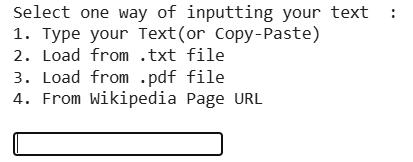
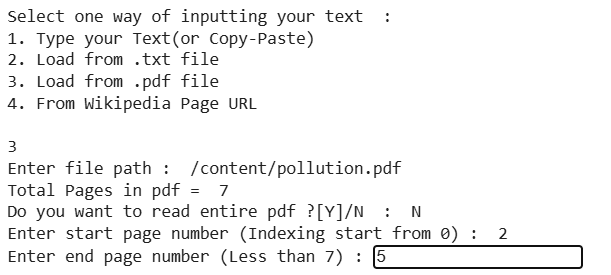
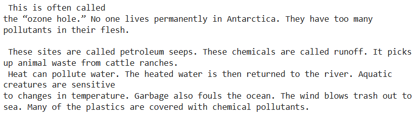
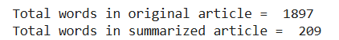
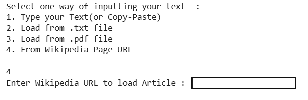
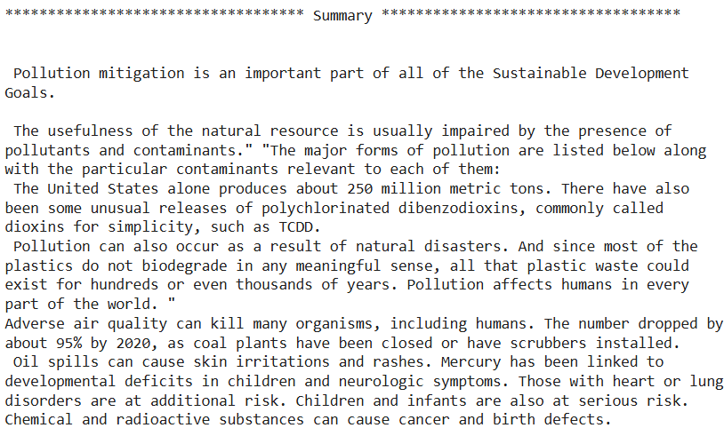
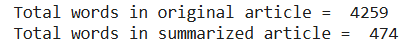

# QuickSummary: Simple NLP Summarizer

## Description

- QuickSummary is an NLP-driven text summarization tool designed to generate concise and accurate summaries from large articles. It supports multiple input methods and leverages efficient algorithms to deliver high-performance results, making text summarization accessible and scalable.

## Key Features

- Utilizes TF-IDF algorithm to create precise and concise summaries from complex texts.
- Supports flexible input methods: manual text, PDF files, and Wikipedia URLs with automated content extraction.
- Optimized Python-based text processing for scalability, enabling page-specific summarization and high-performance analysis.
- Features a command-line interaction for user-friendly access to summarize diverse text sources.

## Skills & Tools

- Skills: Natural Language Processing (NLP), Python programming, data processing, algorithm optimization, text extraction.
- Tools: TF-IDF algorithm, Python, command-line interface, text extraction techniques.

## Purpose :- 

- To save time while reading by summarizing a large article or text into fewer lines. 

## Timeline

- Mar 2025: Developed and implemented the QuickSummary project with a focus on efficient NLP summarization.

## Features :-

### Input Text ( Four Ways )

  

## Example:- PDF
### Input Page-

   

  

     
### Summary Page

  

### Summary Page Word Count

  

## Example:- WIKIPEDIA LINK

### Input Page-

   

  

     
### Summary Page

  

### Summary Page Word Count

  
  
## Requirements :-

- Python3 
- Spacy Module (short, medium, or long, any type is sufficient)
- NLTK Module
- PyPdf2
- Beautiful Soup (bs4)

